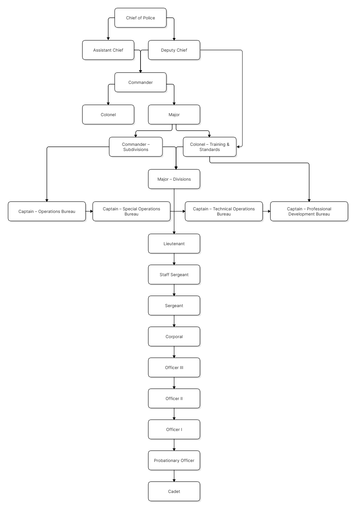

# Chain of Command

The Chain of Command is a set structure of department members who can assist you with any comments, questions or concerns you may have. A patrol supervisor is the beginning of the Chain of Command (COC). If a patrol supervisor cannot assist you they will refer you to a higher ranking member of the LSPD. If an issue arises with a unit immediate chain of command the unit shall be permitted to skip that person and contact the next individual within the Chain Of Command. Failure to abide by these standards may result in disciplinary action.

Some COC members may have an open door policy, allowing you to come directly to them. Please check if this is the case prior to directing questions towards them in Private Messages.

For the majority of concerns, we suggest opening an LSPD Inquiry ticket in the main discord.

Staff Sergeants shall be at the top of the Chain Of Command in regards to the LSPD Probationary Program.

Sergants shall possess a Supervisory role over the LSPD Probationary Program.
